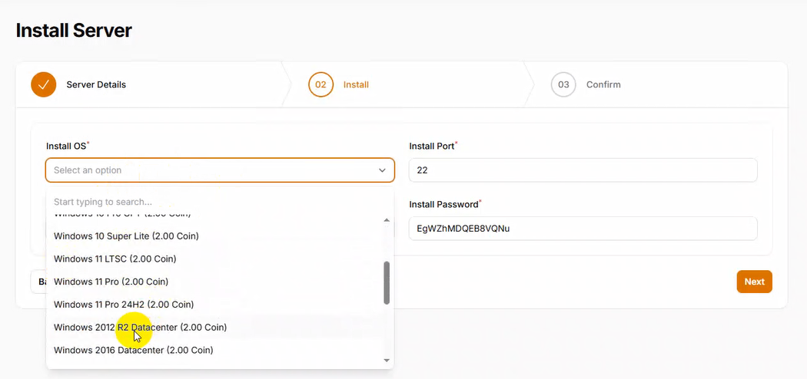

# Prepare Linux VPS for Windows installation

- OS: Debian or Ubuntu
- SSH access to the VPS with root user

# Install Windows on Linux VPS
1. Login to website https://vpsinstall.top
2. Fill in the form with your VPS details:
   
   - Hostname: IP address of your VPS
   - Password: root password of your VPS
   - Port: 22
3. Click on the "Next" button.
4. Select the Windows version you want to install.

5. Click on the "Install" button.

6. Wait for the installation to complete. It may take some time.

7. Once the installation is complete, you will see a success message.
